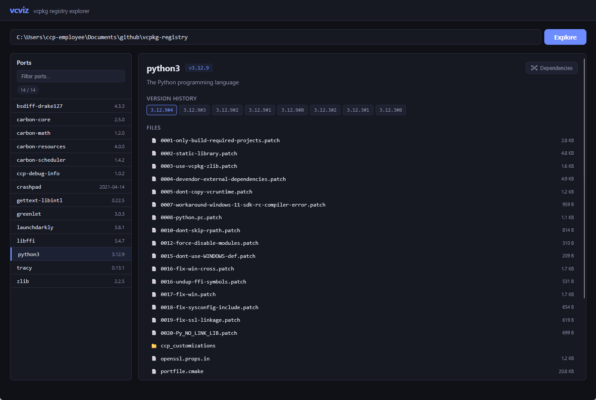
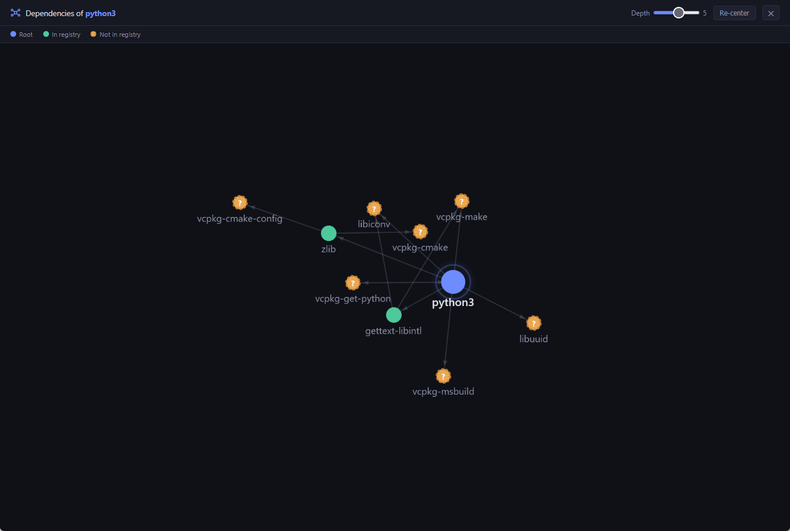

# vcviz

Explore any vcpkg registry by providing its GitHub URL or a path to a local clone. Browse all ports, view version history, inspect port files, and visualise dependency trees.





## Quick start

```bash
npm install
npm start
```

Open [http://localhost:3000](http://localhost:3000) and enter a registry source:

- **GitHub URL** -- e.g. `https://github.com/microsoft/vcpkg`
- **Local path** -- e.g. `C:\vcpkg` or `/home/user/vcpkg`

Using a local clone avoids GitHub API rate limits entirely.

## GitHub API rate limits

When using a GitHub URL, unauthenticated requests are limited to 60/hour. To raise the limit to 5,000/hour, set a personal access token:

```bash
GITHUB_TOKEN=ghp_xxx npm start
```
